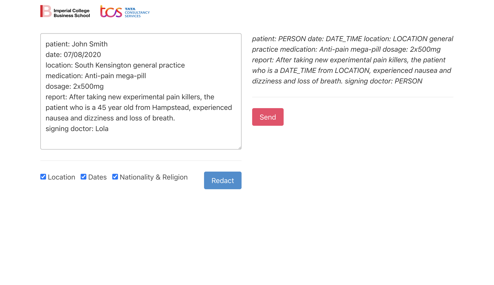

# Digital Transformations Hackathon!
> Imperial College Business School
> ➕
>  TATA Consultancy Services

## 🏆 2nd place!
After a gruelling 24hrs grinding away at our solution, we came second!!!

We're incredibly happy to see our efforts paid-off, and even more impressed that a slightly more polished version of our final demo won first place. We were so close to winning it all!

## 💛 Our team
We had five members on our team...

- Julius
- Salamat
- Sina
- Aayush
- Aaron

## 📢 Challenge brief

> How can large UK Biopharma reduce cycle time of adverse events reporting to regulators ( e.g., FDA, MHRA ), by replacing manual method to identify and redact personally identifiable information (PII) with an intelligent automation?

## ✨ Our solution
We identified 3 key stakeholders...
1. **The compliance officer**
    - Professionaly responsible for collecting and processing anonymised data
    - Outsources redaction to be done manually by third-party entity at a premium
2. **The busy doctor**
    - Deprioritises filling adverse effects report due to time constraints.
    - Misses significant number of cases 
3. **The vulnerable patient**
    - Requires anonymity to avoid possible backlash
    - Pefers to report in natural language
    - Non-GDPR expert

All 3 stakeholders essentially want the same thing. A method to directly report information that...

1. Guarantees anonymity, and is regulation compliant
2. Is easy to use, prefereably through some form of natural language
3. Is quick to complete

Our answer is to develop a comprehensive pipeline for automated reporting that includes 
* Multi-source data collection (text, SPEECH, handwriting, images, etc)
* Client-Side GDPR-compliant anonymisation
* Encryption
* Transmission
* Information extraction
* Tagging
* Analysis

We believe such a system is dramatically better at adressing the pain-points of all of out stakeholders.
1. **The compliance officer** benefits from
    - reduced cost
    - scalability
2. **The busy doctor** benefits from
    - speed
    - ease of use
3. **The vulnerable patient** benefits from
    - anonymity
    - agency

For out demo, we leveraged the `en_core_web_lg` natural language processing (NLP) model to detect personally identifiable information (PII) to show how anonymisation is likely to work.

